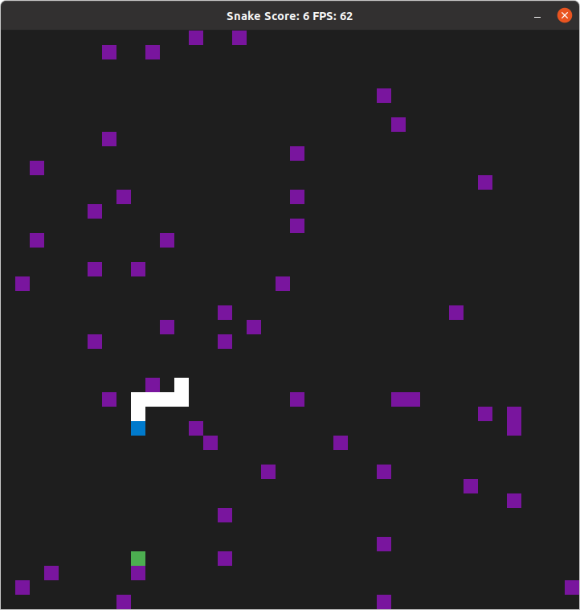

# CPPND: Capstone Snake Game Example

This project is based on the starter repo for the Capstone project in the [Udacity C++ Nanodegree Program](https://www.udacity.com/course/c-plus-plus-nanodegree--nd213). The code for the starter repo was inspired by [this](https://codereview.stackexchange.com/questions/212296/snake-game-in-c-with-sdl) excellent StackOverflow post and set of responses.

## Dependencies for Running Locally
* cmake >= 3.7
  * All OSes: [click here for installation instructions](https://cmake.org/install/)
* make >= 4.1 (Linux, Mac), 3.81 (Windows)
  * Linux: make is installed by default on most Linux distros
  * Mac: [install Xcode command line tools to get make](https://developer.apple.com/xcode/features/)
  * Windows: [Click here for installation instructions](http://gnuwin32.sourceforge.net/packages/make.htm)
* SDL2 >= 2.0
  * All installation instructions can be found [here](https://wiki.libsdl.org/Installation)
  >Note that for Linux, an `apt` or `apt-get` installation is preferred to building from source. 
* gcc/g++ >= 5.4
  * Linux: gcc / g++ is installed by default on most Linux distros
  * Mac: same deal as make - [install Xcode command line tools](https://developer.apple.com/xcode/features/)
  * Windows: recommend using [MinGW](http://www.mingw.org/)

##  Build Instructions

1. Clone this repo.
2. Make a build directory in the top level directory: `mkdir build && cd build`
3. Compile: `cmake .. && make`
4. Run it: `./SnakeGame`.
5. You can edit some game parameters without recompiling by editing the runtimeConfig.txt text file

## Feautures Added to Starter Code
1. Purple Barriers are randomly distributed around the map, hitting a barrier kills the snake and ends the game
2. Pause Button - spacebar can be pressed to pause the game at any time, additionally, the game starts paused so that you can asses barrier locations before starting
3. Window size, number of grid squares to a side, and number of barriers can be changed without recompiling by editing runtimeConfig.txt
4. 'Ripe' Food - for the first 15 seconds after a food tile appears it will appear green rather than yellow, if you consume the food while it is still green, your speed will remain the same rather than increase, this is a buff as higher speed makes it harder to avoid barriers while going for food.

## Ruberic Points

### Loop/IO
1. Projects Reads Data from a file - See utils.h / utils.cpp (parseSetupInfo Specifically), runtimeConfig.txt, the program reads in the window size, number of grids, and number of barriers to place at runtime.
2. Project Accepts user input and processes the input - Spacebar pauses the game (controller.cpp lines 38-47; game.h line 32; game.cpp line 90)
3. The project uses data structures and immutable variables - BarrierManager uses a vector to store pointers to each barrier (barriers.h line 27), Barrier stores its position in const ints (Barriers.h line 15,16)

### OOP
1. One or more classes are added to the project with appropriate access specifiers for class memberbers - Classes Barrier and BarrierManager are added with in each of their cases it happens to be that all of their data members are private while all of their methods are public (see barriers.h)
2. Use Member intiialization list - BartrierManager Constructor uses Member initialization list as does Barier to set all const data members as well as others (see barriers.cpp line 7, 18-30).The overload of the constructor for the Renderer class I defined (renderer.cpp line 30) also uses a member initialization list.
3. Overloaded functions allow the same function to operate on different parameters - Overloaded the Renderer class constructor for a square window, accepting 2 parameters instead of 4 (renderer.h lines 12-17, renderer.cpp lines 5-68)

### Memory Management
1. The Project makes use of references in function declarations - the bool pause is passed as a reference in Controller::HandleInput as well as in Controller::TogglePause (see controller.h line 8, 13)
2. The Project uses destructors appropriately - the class BarrierManager allocates Barrier objects on the heap and stores their pointers in a vector, its destructor loops over the vector and frees each pointer (see barriers.cpp line 44-47)
3. The project uses scope/RAII - BarrierManager allocates and Initializes Barriers on the heap under the hood when it is initialized, it frees all of the Barrier objects when the Barrier Manager object has its destructor called (when all of the shared ptrs to it fall out of scope) (see barriers.h and barriers.cpp).
4. The project uses smart pointers - BarrierManager is itself managed using a shared_pointer which is shared with the Renderer and Game objects (see main.cpp line 18,19,21)

### Concurrency
1. The Project uses multithreading - A timer is started up in a seperate thread (and detached) to determine wheen food will no longer be ripe see Game::BonusFoodTimer() (game.cpp lines 140-169) the thread is launched and detached in Game::Update() (see game.cpp lines 100-127)
2. A Mutex or a lock is used in the project - A mutex (pause_mtx) is used to protect the member varaible Game::paused as both the main thread and the timer thread need to read it so the timer does not run out while the game is paused (see game.cpp line 89-91, 166-167; controller.cpp line 42-44,  ). Additionally a Mutex is used to protect Game::is_bonus_food_active see Game::BonusFoodTimer() (game.cpp lines 140-167) as well as Game::Update(game.cpp lines 101-124)
3. A condition variable is used in the project - A condition variable (game::condition_var) is used in coordination with bool Game::is_bonus_food_active to notify the Ripeness timer that it can exit early if the food was eaten while it was ripe, see Game::update() (game.cpp lines 111-126) and Game::Bonus_Food_Timer (game.cpp lines 146, 162)

## CC Attribution-ShareAlike 4.0 International

Shield: [![CC BY-SA 4.0][cc-by-sa-shield]][cc-by-sa]

This work is licensed under a
[Creative Commons Attribution-ShareAlike 4.0 International License][cc-by-sa].

[![CC BY-SA 4.0][cc-by-sa-image]][cc-by-sa]

[cc-by-sa]: http://creativecommons.org/licenses/by-sa/4.0/
[cc-by-sa-image]: https://licensebuttons.net/l/by-sa/4.0/88x31.png
[cc-by-sa-shield]: https://img.shields.io/badge/License-CC%20BY--SA%204.0-lightgrey.svg
